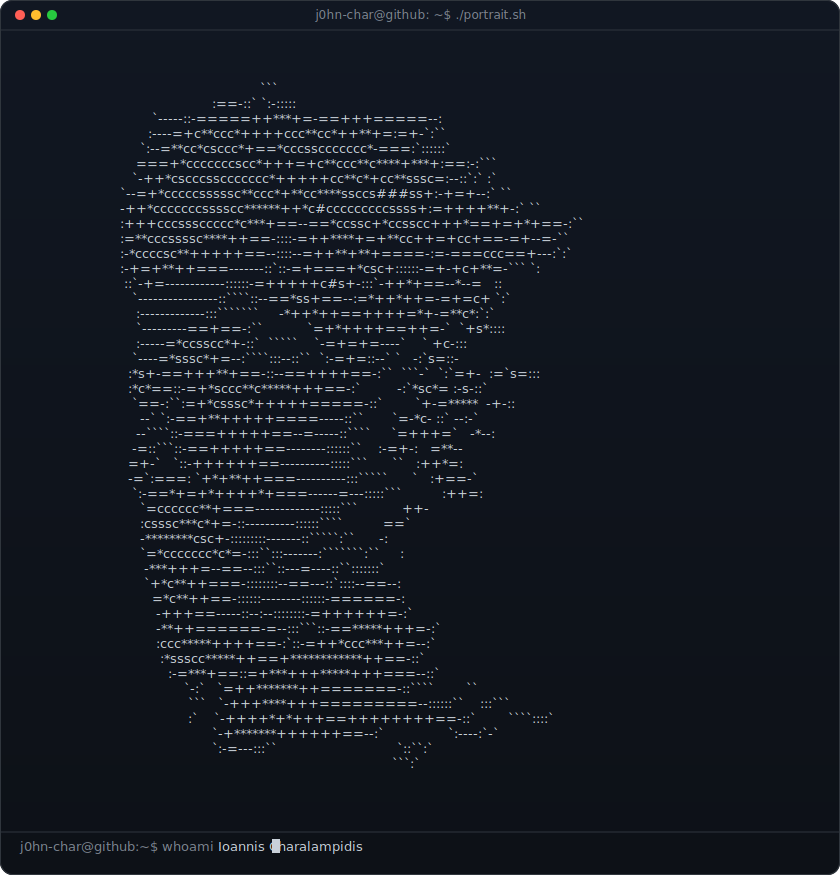
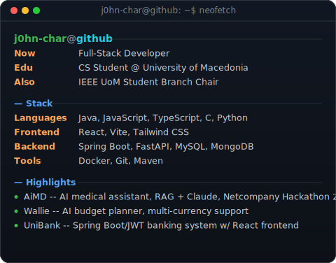

<!--
  This is your PROFILE README. It goes in a repo named exactly after your
  username (e.g. github.com/OCTOCAT/OCTOCAT) so GitHub shows it on your profile.
  Widths 370/490 keep the portrait and info card the same height -- if you
  change the info card's H, re-match these.
-->

<table>
<tr>
<td valign="top"></td>
<td valign="top"></td>
</tr>
</table>

## Ioannis Charalampidis

**Full-Stack Developer · CS Student @ University of Macedonia · IEEE UoM Student Branch Chair**

 

<!-- animated contribution graph, refreshed daily by the workflow -->

